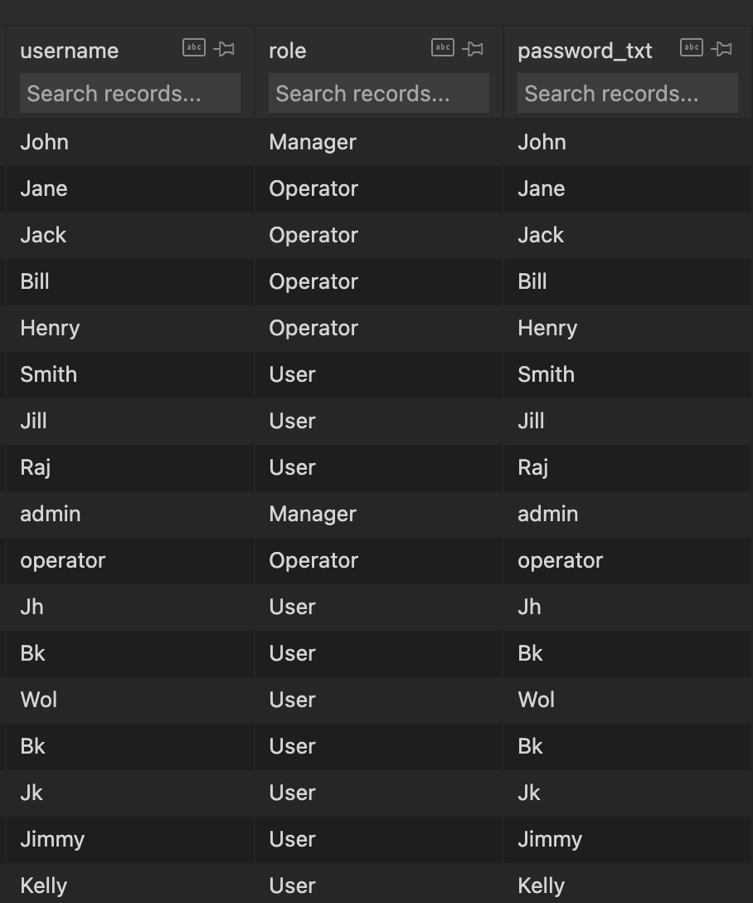

# Bikesharing

## How to run this project

Make sure you have installed `streamlit` and other packages:

`pip install -r requirements.txt`

then, `streamlit run bikeshareApp.py`

## Files

 `bikeshareApp.py` main app

 `initSQL.py` database operation

 `userOperation.py` functions for user 

 `operatorOperation.py` functions for operator 

functions for manager are contained in  `bikeshareApp.py`

`bikeshare.db` (sqlite3) database:

All the account currently in our database: our system only allowed a new account sign up as "User", test the functions for "Manager" and "Operator" please the account below

`actlog.csv` a file generated automatically when a "Manager" view the "visualizations via map" page which contains all the rent activities.

`FunctionalSpecifications.docx`  functions need to be implement
